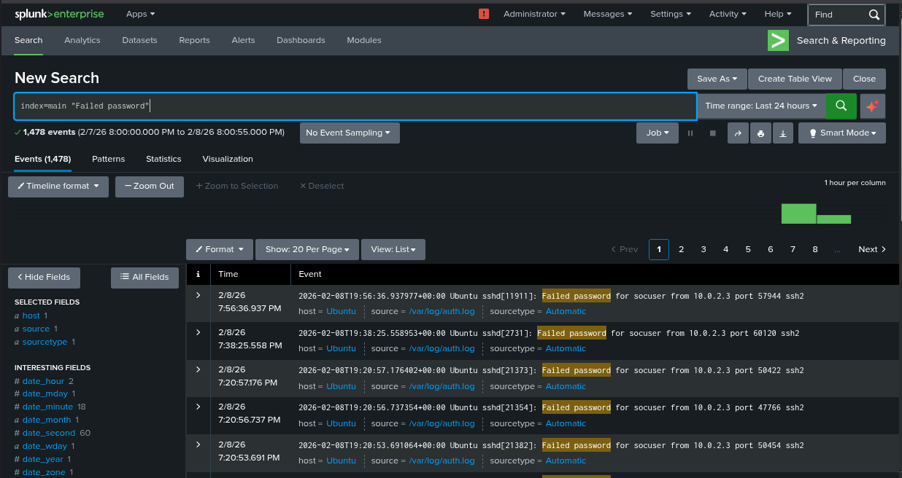
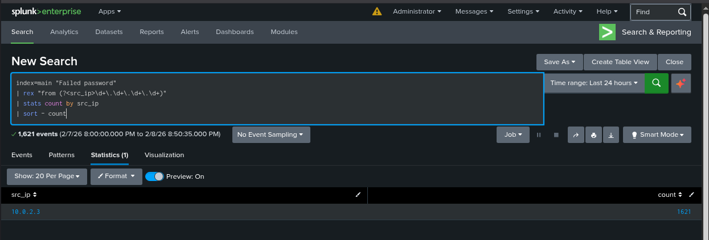
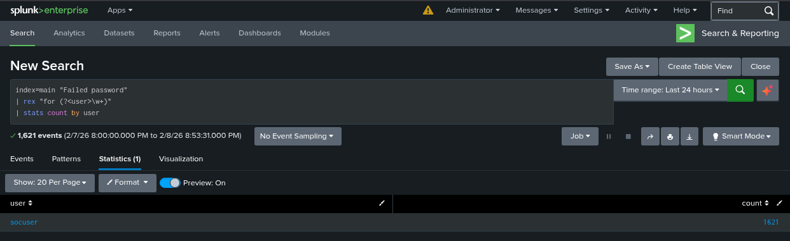

# SSH Brute-Force Detection

## Objective
Simulate and detect an SSH brute-force attack using Splunk in a SOC home lab environment.

## Lab Setup
- Kali Linux (Attacker)
- Ubuntu Server (Target)
- Splunk Enterprise (SIEM)

## Attack Simulation
Hydra was used to generate multiple failed SSH login attempts against an Ubuntu server.

## Detection & Investigation
Splunk was used to analyze Linux authentication logs and identify brute-force activity based on repeated failed login attempts.

## Outcome
The attack was successfully detected through log analysis, demonstrating SOC analyst investigation skills.

## Screenshots
Splunk Searched Queries:-
1. Failed Attempts events:
  
2.Brute-force_stats_by_IP:
  
3.Targeted User Analysis

